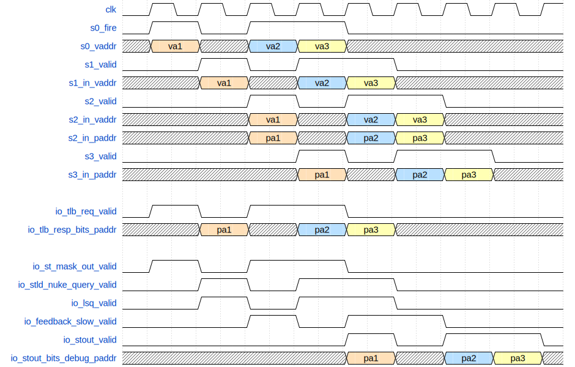

# StoreUnit模块验证文档
## 文档概述

本文档描述了StoreUnit模块的结构与功能，并根据功能给出测试点参考，方便测试的参与者理解测试需求，编写相关测试用例。StoreUnit包括其五级流水线处理流程、支持的三种类型store指令（标量、向量、非对齐）、接口设计与信号交互逻辑。该模块用于执行Store类指令的地址生成与处理，是Load/Store流水线中的关键组成部分。

## 术语说明

| 名称 | 定义 |
| ------- | ---|
| TLB（Translation Lookaside Buffer） | 地址转换旁路缓冲器，用于虚拟地址到物理地址的快速转换 |
| PMP（Physical Memory Protection）	| 物理内存访问权限检查机制 |
| RAW（Read After Write）违例	| 写后读违例，表示一个load指令读取尚未写入的store数据 |
| LSQ（Load Store Queue） | 处理Load/Store指令顺序及依赖检查的数据结构 |
| StoreQueue | 专门用于跟踪Store指令的FIFO队列 |

## 前置知识

在阅读本模块文档前，建议掌握以下知识：
1. RISC-V中的Store指令地址流水线与语义；
2. 虚拟地址与物理地址的映射机制；
3. 异常与中断系统，尤其是地址不对齐异常、页面异常；
4. 向量指令中store语义与mask机制。

<mrs-functions>

## 功能说明

### 1. 支持标量Store指令

#### 1.1 地址计算与对齐检查（S0）
- 输入：来自store issue队列的指令
- 处理：
  - 计算虚拟地址（VA）
  - 检查地址是否对齐，并标记`storeAddrMisaligned`
  - 发起TLB请求（`io.tlb.req`）
  - 生成mask，输出到StoreQueue
- 输出：`s0_mask_out`

#### 1.2 TLB与RAW违例处理（S1）
- 输入：TLB响应（`io.tlb.resp`）
- 处理：
  - 将TLB响应写入StoreQueue
  - 向LoadQueue发出RAW检测
  - 如果TLB命中，则向后端发出issue信息（`io.issue`）

#### 1.3 异常与反馈更新（S2）
- 输入：PMP检查结果（`io.pmp`）
- 处理：
  - 异常信号更新至ROB
  - 将TLB miss反馈发送至RS（`feedback_slow`）
  - 将其他信息写入LSQ

#### 1.4 同步一拍（S3）
- 处理：用于与RAW违例检测对齐同步

#### 1.5 发起写回（S4）
- 输出：
  - 普通store结果写回后端（`stout`）

### 2. 支持向量Store指令

#### 2.1 接收vsSplit请求（S0）
- 来自VecStIn通道（`io.vecstin`），高优先级，无需地址计算

#### 2.2 计算向量偏移（S1）
- 计算vecVaddrOffset、vecTriggerMask
- 向LSQ写入store数据

#### 2.3 忽略feedback（S2）
- 不需要向后端RS发送反馈信息

#### 2.4 发起向量写回（S4）
- 输出：向量store结果写回（`vecstout`）

### 3. 支持非对齐Store指令

#### 3.1 非对齐请求处理（S0）
- 来自MisalignBuffer（`misalign_stin`），优先级最高

#### 3.2 判断是否进入MisalignBuffer（S2）
- 如果是新请求且未对齐但不跨16B边界，则进入MisalignBuffer（`misalign_enq`）
- 如果来自MisalignBuffer：
  - TLB miss则重发（`misalign_stout`）
  - 否则发起写回

</mrs-functions>

## 常量说明

| 常量名 | 常量值 | 解释 |
| ------ | ------ | ---- |
| VAddrBits | 50 | 虚拟地址位宽 |
| XLEN | 64 | 数据位宽 |
| VLEN | 128 | 向量长度 |
| RAWTotalDelayCycles | 1 | RAW违例处理延迟周期 |

## 接口说明

### 输入接口
| 信号名 | 方向 | 位宽 | 描述 |
|--------|------|------|------|
| clock | input | 1 | 时钟信号，用于同步时序 |
| reset | input | 1 | 复位信号，用于重置模块状态 |
| io_redirect_valid | input | 1 | 重定向有效信号，指示是否有重定向操作 |
| io_redirect_bits_robIdx_flag | input | 1 | 重定向ROB索引标志，指示是否需要重定向 |
| io_redirect_bits_robIdx_value | input | 8 | 重定向ROB索引值 |
| io_redirect_bits_level | input | 1 | 重定向级别信号，表示重定向的优先级 |
| io_csrCtrl_hd_misalign_st_enable | input | 1 | 控制Misalign Store启用信号，指示是否启用未对齐存储 |
| io_stin_valid | input | 1 | 输入有效信号，指示是否有有效的存储指令 |
| io_stin_bits_uop_ftqPtr_flag | input | 1 | 指令FTQ指针标志，标记指令在队列中的位置 |
| io_stin_bits_uop_ftqPtr_value | input | 6 | 指令FTQ指针值，指示指令在队列中的位置 |
| io_stin_bits_uop_ftqOffset | input | 4 | 指令FTQ偏移量，指示指令在队列中的偏移 |
| io_stin_bits_uop_fuType | input | 35 | 功能单元类型，指示该指令使用的功能单元类型 |
| io_stin_bits_uop_fuOpType | input | 9 | 功能单元操作类型，指示该指令执行的操作类型 |
| io_stin_bits_uop_rfWen | input | 1 | 指令是否写入寄存器，表示是否更新寄存器值 |
| io_stin_bits_uop_imm | input | 32 | 指令立即数，包含该指令中的常数值 |
| io_stin_bits_uop_pdest | input | 8 | 指令目的寄存器编号，表示数据存储的目标寄存器 |
| io_stin_bits_uop_robIdx_flag | input | 1 | ROB索引标志，表示是否使用ROB索引 |
| io_stin_bits_uop_robIdx_value | input | 8 | ROB索引值，指示指令对应的ROB索引 |
| io_stin_bits_uop_debugInfo_eliminatedMove | input | 1 | 指令优化消除的移动，标识指令是否被优化 |
| io_stin_bits_uop_debugInfo_renameTime | input | 64 | 指令重命名时间，记录指令的重命名时间 |
| io_stin_bits_uop_debugInfo_dispatchTime | input | 64 | 指令调度时间，记录指令进入调度队列的时间 |
| io_stin_bits_uop_debugInfo_enqRsTime | input | 64 | 指令入队时间，记录指令进入执行队列的时间 |
| io_stin_bits_uop_debugInfo_selectTime | input | 64 | 指令选择时间，记录指令被选中执行的时间 |
| io_stin_bits_uop_debugInfo_issueTime | input | 64 | 指令发射时间，指示指令进入执行单元的时间 |
| io_stin_bits_uop_debugInfo_writebackTime | input | 64 | 指令回写时间，表示指令将结果回写到寄存器的时间 |
| io_stin_bits_uop_debugInfo_runahead_checkpoint_id | input | 64 | 预执行检查点ID，用于标记预执行阶段的检查点 |
| io_stin_bits_uop_debugInfo_tlbFirstReqTime | input | 64 | TLB首次请求时间，记录指令发起首次TLB请求的时间 |
| io_stin_bits_uop_debugInfo_tlbRespTime | input | 64 | TLB响应时间，记录指令收到TLB响应的时间 |
| io_stin_bits_uop_lqIdx_flag | input | 1 | Load Queue索引标志，指示是否使用Load Queue |
| io_stin_bits_uop_lqIdx_value | input | 7 | Load Queue索引值，标识该指令在Load Queue中的位置 |
| io_stin_bits_uop_sqIdx_flag | input | 1 | Store Queue索引标志，指示是否使用Store Queue |
| io_stin_bits_uop_sqIdx_value | input | 6 | Store Queue索引值，标识该指令在Store Queue中的位置 |
| io_stin_bits_src_0 | input | 64 | 数据源0，提供给指令执行的数据源 |
| io_stin_bits_isFirstIssue | input | 1 | 是否是第一次发射，表示指令是否首次被发射 |
| io_misalign_stin_valid | input | 1 | Misalign Store输入有效信号，指示Misalign Store是否接收有效数据 |
| io_misalign_stin_bits_uop_exceptionVec_0 | input | 1 | Misalign Store输入异常向量0，表示是否发生异常 |
| io_misalign_stin_bits_uop_exceptionVec_1 | input | 1 | Misalign Store输入异常向量1，表示是否发生异常 |
| io_misalign_stin_bits_uop_exceptionVec_2 | input | 1 | Misalign Store输入异常向量2，表示是否发生异常 |
| io_misalign_stin_bits_uop_exceptionVec_4 | input | 1 | Misalign Store输入异常向量4，表示是否发生异常 |
| io_misalign_stin_bits_uop_exceptionVec_5 | input | 1 | Misalign Store输入异常向量5，表示是否发生异常 |
| io_misalign_stin_bits_uop_exceptionVec_8 | input | 1 | Misalign Store输入异常向量8，表示是否发生异常 |
| io_misalign_stin_bits_uop_exceptionVec_9 | input | 1 | Misalign Store输入异常向量9，表示是否发生异常 |
| io_misalign_stin_bits_uop_exceptionVec_10 | input | 1 | Misalign Store输入异常向量10，表示是否发生异常 |
| io_misalign_stin_bits_uop_exceptionVec_11 | input | 1 | Misalign Store输入异常向量11，表示是否发生异常 |
| io_misalign_stin_bits_uop_exceptionVec_12 | input | 1 | Misalign Store输入异常向量12，表示是否发生异常 |
| io_misalign_stin_bits_uop_exceptionVec_13 | input | 1 | Misalign Store输入异常向量13，表示是否发生异常 |
| io_misalign_stin_bits_uop_exceptionVec_14 | input | 1 | Misalign Store输入异常向量14，表示是否发生异常 |
| io_misalign_stin_bits_uop_exceptionVec_16 | input | 1 | Misalign Store输入异常向量16，表示是否发生异常 |
| io_misalign_stin_bits_uop_exceptionVec_17 | input | 1 | Misalign Store输入异常向量17，表示是否发生异常 |
| io_misalign_stin_bits_uop_exceptionVec_18 | input | 1 | Misalign Store输入异常向量18，表示是否发生异常 |
| io_misalign_stin_bits_uop_exceptionVec_19 | input | 1 | Misalign Store输入异常向量19，表示是否发生异常 |
| io_misalign_stin_bits_uop_exceptionVec_20 | input | 1 | Misalign Store输入异常向量20，表示是否发生异常 |
| io_misalign_stin_bits_uop_exceptionVec_21 | input | 1 | Misalign Store输入异常向量21，表示是否发生异常 |
| io_misalign_stin_bits_uop_exceptionVec_22 | input | 1 | Misalign Store输入异常向量22，表示是否发生异常 |
| io_misalign_stin_bits_uop_ftqPtr_flag | input | 1 | Misalign Store输入FTQ指针标志，表示指令位置 |
| io_misalign_stin_bits_uop_ftqPtr_value | input | 6 | Misalign Store输入FTQ指针值，指示指令在队列中的位置 |
| io_misalign_stin_bits_uop_ftqOffset | input | 4 | Misalign Store输入FTQ偏移量，表示指令在队列中的偏移 |
| io_misalign_stin_bits_uop_fuType | input | 35 | Misalign Store输入功能单元类型，表示指令所需的功能单元 |
| io_misalign_stin_bits_uop_fuOpType | input | 9 | Misalign Store输入功能单元操作类型，表示指令执行的操作类型 |
| io_misalign_stin_bits_uop_rfWen | input | 1 | Misalign Store输入是否写入寄存器，标识是否会更新寄存器 |
| io_misalign_stin_bits_uop_vpu_vstart | input | 8 | Misalign Store输入VPU向量起始位置，标识向量操作的起始位置 |
| io_misalign_stin_bits_uop_vpu_nf | input | 3 | Misalign Store输入VPU向量元素数，表示该向量操作的元素数量 |
| io_misalign_stin_bits_uop_vpu_veew | input | 2 | Misalign Store输入VPU向量元素宽度，表示向量的元素宽度 |
| io_misalign_stin_bits_uop_uopIdx | input | 7 | Misalign Store输入操作索引，表示该指令的操作索引 |
| io_misalign_stin_bits_uop_pdest | input | 8 | Misalign Store输入目的寄存器，表示存储的目标寄存器 |
| io_misalign_stin_bits_uop_robIdx_flag | input | 1 | Misalign Store输入ROB索引标志，表示是否使用ROB索引 |
| io_misalign_stin_bits_uop_robIdx_value | input | 8 | Misalign Store输入ROB索引值，表示该操作对应的ROB索引 |
| io_misalign_stin_bits_uop_debugInfo_eliminatedMove | input | 1 | Misalign Store输入优化消除的移动，表示该操作是否被优化消除 |
| io_misalign_stin_bits_uop_debugInfo_renameTime | input | 64 | Misalign Store输入指令重命名时间，记录指令的重命名时间 |
| io_misalign_stin_bits_uop_debugInfo_dispatchTime | input | 64 | Misalign Store输入指令调度时间，表示指令进入调度队列的时间 |
| io_misalign_stin_bits_uop_debugInfo_enqRsTime | input | 64 | Misalign Store输入指令入队时间，表示指令加入执行队列的时间 |
| io_misalign_stin_bits_uop_debugInfo_selectTime | input | 64 | Misalign Store输入指令选择时间，表示指令被选中执行的时间 |
| io_misalign_stin_bits_uop_debugInfo_issueTime | input | 64 | Misalign Store输入指令发射时间，表示指令发射到执行单元的时间 |
| io_misalign_stin_bits_uop_debugInfo_writebackTime | input | 64 | Misalign Store输入指令回写时间，表示指令回写结果的时间 |
| io_misalign_stin_bits_uop_debugInfo_runahead_checkpoint_id | input | 64 | Misalign Store输入指令预执行检查点ID，标记指令的预执行检查点 |
| io_misalign_stin_bits_uop_debugInfo_tlbFirstReqTime | input | 64 | Misalign Store输入指令TLB首次请求时间，表示该指令发起首次TLB请求的时间 |
| io_misalign_stin_bits_uop_debugInfo_tlbRespTime | input | 64 | Misalign Store输入指令TLB响应时间，表示该指令收到TLB响应的时间 |
| io_misalign_stin_bits_uop_lqIdx_flag | input | 1 | Misalign Store输入Load Queue索引标志，表示是否使用Load Queue |
| io_misalign_stin_bits_uop_lqIdx_value | input | 7 | Misalign Store输入Load Queue索引值，标识该指令在Load Queue中的位置 |
| io_misalign_stin_bits_uop_sqIdx_flag | input | 1 | Misalign Store输入Store Queue索引标志，表示是否使用Store Queue |
| io_misalign_stin_bits_uop_sqIdx_value | input | 6 | Misalign Store输入Store Queue索引值，标识该指令在Store Queue中的位置 |
| io_misalign_stin_bits_vaddr | input | 50 | Misalign Store输入虚拟地址，表示存储请求的虚拟地址 |
| io_misalign_stin_bits_mask | input | 16 | Misalign Store输入掩码，标识存储操作涉及的字节 |
| io_misalign_stin_bits_isvec | input | 1 | Misalign Store输入是否为向量操作，指示是否为向量Store指令 |
| io_misalign_stin_bits_is128bit | input | 1 | Misalign Store输入是否为128位操作，标识该操作是否为128位数据存储 |
| io_misalign_stin_bits_isFinalSplit | input | 1 | Misalign Store输入是否为最终分割，指示该操作是否为最后一次存储操作 |
| io_tlb_resp_valid | input | 1 | TLB响应有效信号，指示是否收到有效的TLB响应 |
| io_tlb_resp_bits_paddr_0 | input | 48 | TLB响应物理地址0，表示TLB响应中的物理地址 |
| io_tlb_resp_bits_gpaddr_0 | input | 64 | TLB响应通用物理地址0，提供对应的物理地址 |
| io_tlb_resp_bits_fullva | input | 64 | TLB响应完整虚拟地址，表示该指令请求的完整虚拟地址 |
| io_tlb_resp_bits_pbmt_0 | input | 2 | TLB响应页面映射类型0，指示TLB响应的页面映射类型 |
| io_tlb_resp_bits_miss | input | 1 | TLB响应是否命中，指示TLB是否命中请求的地址 |
| io_tlb_resp_bits_isForVSnonLeafPTE | input | 1 | TLB响应是否为非叶PTE，指示是否为虚拟化的非叶页面表项 |
| io_tlb_resp_bits_excp_0_vaNeedExt | input | 1 | TLB响应是否需要扩展虚拟地址，表示是否需要扩展地址 |
| io_tlb_resp_bits_excp_0_isHyper | input | 1 | TLB响应是否为Hypervisor模式的异常，表示TLB异常是否是超级管理模式 |
| io_tlb_resp_bits_excp_0_gpf_st | input | 1 | TLB响应是否为一般保护异常，指示TLB请求是否发生一般保护错误 |
| io_tlb_resp_bits_excp_0_pf_st | input | 1 | TLB响应是否为页面错误异常，指示TLB请求是否发生页面错误 |
| io_tlb_resp_bits_excp_0_af_st | input | 1 | TLB响应是否为地址错误异常，指示TLB请求是否发生地址错误 |
| io_tlb_resp_bits_ptwBack | input | 1 | TLB响应是否为物理地址翻译回写，表示TLB响应是否涉及物理地址回写 |
| io_tlb_resp_bits_memidx_idx | input | 7 | TLB响应内存索引索引，指示TLB响应所在的内存块索引 |
| io_pmp_st | input | 1 | PMP状态信号，表示是否为物理内存保护状态 |
| io_pmp_mmio | input | 1 | PMP内存映射IO信号，表示是否涉及内存映射IO |
| io_pmp_atomic | input | 1 | PMP原子操作信号，表示是否为原子操作请求 |
| io_prefetch_req_bits_vaddr | input | 50 | 预取请求的虚拟地址，表示请求的虚拟地址 |
| io_vecstin_valid | input | 1 | 向量Store输入有效信号，指示是否有有效的输入数据 |
| io_vecstin_bits_vaddr | input | 64 | 向量Store输入虚拟地址，表示该操作的虚拟地址 |
| io_vecstin_bits_basevaddr | input | 50 | 向量Store输入基准虚拟地址，表示向量操作的基准虚拟地址 |
| io_vecstin_bits_mask | input | 16 | 向量Store输入掩码，表示该向量操作涉及的字节 |
| io_vecstin_bits_alignedType | input | 3 | 向量Store输入对齐类型，表示向量操作的对齐类型 |
| io_vecstin_bits_vecActive | input | 1 | 向量Store输入是否为激活的向量操作 |
| io_vecstin_bits_uop_exceptionVec_4 | input | 1 | 向量Store输入异常向量4，表示是否发生异常 |
| io_vecstin_bits_uop_exceptionVec_5 | input | 1 | 向量Store输入异常向量5，表示是否发生异常 |
| io_vecstin_bits_uop_exceptionVec_6 | input | 1 | 向量Store输入异常向量6，表示是否发生异常 |
| io_vecstin_bits_uop_exceptionVec_13 | input | 1 | 向量Store输入异常向量13，表示是否发生异常 |
| io_vecstin_bits_uop_exceptionVec_21 | input | 1 | 向量Store输入异常向量21，表示是否发生异常 |
| io_vecstin_bits_uop_ftqPtr_flag | input | 1 | 向量Store输入FTQ指针标志，表示指令在队列中的位置 |
| io_vecstin_bits_uop_ftqPtr_value | input | 6 | 向量Store输入FTQ指针值，指示指令在队列中的位置 |
| io_vecstin_bits_uop_ftqOffset | input | 4 | 向量Store输入FTQ偏移量，表示指令在队列中的偏移 |
| io_vecstin_bits_uop_fuType | input | 35 | 向量Store输入功能单元类型，表示指令所需的功能单元 |
| io_vecstin_bits_uop_fuOpType | input | 9 | 向量Store输入功能单元操作类型，表示指令执行的操作类型 |
| io_vecstin_bits_uop_rfWen | input | 1 | 向量Store输入是否写入寄存器，表示该指令是否会更新寄存器值 |
| io_vecstin_bits_uop_vpu_vstart | input | 8 | 向量Store输入VPU向量起始位置，标识向量操作的起始位置 |
| io_vecstin_bits_uop_vpu_nf | input | 3 | 向量Store输入VPU向量元素数，表示该向量操作的元素数量 |
| io_vecstin_bits_uop_vpu_veew | input | 2 | 向量Store输入VPU向量元素宽度，表示向量的元素宽度 |
| io_vecstin_bits_uop_uopIdx | input | 7 | 向量Store输入操作索引，表示该指令的操作索引 |
| io_vecstin_bits_uop_pdest | input | 8 | 向量Store输入目的寄存器，表示存储的目标寄存器 |
| io_vecstin_bits_uop_robIdx_flag | input | 1 | 向量Store输入ROB索引标志，表示是否使用ROB索引 |
| io_vecstin_bits_uop_robIdx_value | input | 8 | 向量Store输入ROB索引值，表示该操作对应的ROB索引 |
| io_vecstin_bits_uop_debugInfo_eliminatedMove | input | 1 | 向量Store输入优化消除的移动，标识该操作是否被优化消除 |
| io_vecstin_bits_uop_debugInfo_renameTime | input | 64 | 向量Store输入指令重命名时间，表示该Store指令的重命名时间 |
| io_vecstin_bits_uop_debugInfo_dispatchTime | input | 64 | 向量Store输入指令调度时间，表示该Store指令的调度时间 |
| io_vecstin_bits_uop_debugInfo_enqRsTime | input | 64 | 向量Store输入指令入队时间，表示该Store指令的入队时间 |
| io_vecstin_bits_uop_debugInfo_selectTime | input | 64 | 向量Store输入指令选择时间，表示该Store指令的选择时间 |
| io_vecstin_bits_uop_debugInfo_issueTime | input | 64 | 向量Store输入指令发射时间，表示该Store指令的发射时间 |
| io_vecstin_bits_uop_debugInfo_writebackTime | input | 64 | 向量Store输入指令回写时间，表示该Store指令的回写时间 |
| io_vecstin_bits_uop_debugInfo_runahead_checkpoint_id | input | 64 | 向量Store输入指令预执行检查点ID，标记该Store指令的预执行阶段 |
| io_vecstin_bits_uop_debugInfo_tlbFirstReqTime | input | 64 | 向量Store输入指令TLB首次请求时间，表示该Store指令的首次TLB请求时间 |
| io_vecstin_bits_uop_debugInfo_tlbRespTime | input | 64 | 向量Store输入指令TLB响应时间，表示该Store指令的TLB响应时间 |
| io_vecstin_bits_uop_lqIdx_flag | input | 1 | 向量Store输入Load Queue索引标志，指示是否使用Load Queue |
| io_vecstin_bits_uop_lqIdx_value | input | 7 | 向量Store输入Load Queue索引值，标识该指令在Load Queue中的位置 |
| io_vecstin_bits_uop_sqIdx_flag | input | 1 | 向量Store输入Store Queue索引标志，指示是否使用Store Queue |
| io_vecstin_bits_uop_sqIdx_value | input | 6 | 向量Store输入Store Queue索引值，标识该指令在Store Queue中的位置 |
| io_vecstin_bits_mBIndex | input | 4 | 向量Store输入块索引，标识该向量操作的块索引 |
| io_vecstin_bits_elemIdx | input | 8 | 向量Store输入元素索引，标识该向量操作的元素索引 |
| io_misalign_buf_ready | input | 1 | Misalign缓冲区准备信号，指示Misalign操作是否准备好接收数据 |
| io_fromCsrTrigger_tdataVec_0_matchType | input | 2 | 从CSR触发器接收的数据向量0匹配类型，指示匹配类型 |
| io_fromCsrTrigger_tdataVec_0_select | input | 1 | 从CSR触发器接收的数据向量0选择标志，指示是否选择该向量 |
| io_fromCsrTrigger_tdataVec_0_timing | input | 1 | 从CSR触发器接收的数据向量0定时标志，表示触发的定时信息 |
| io_fromCsrTrigger_tdataVec_0_action | input | 4 | 从CSR触发器接收的数据向量0动作类型，表示触发动作 |
| io_fromCsrTrigger_tdataVec_0_chain | input | 1 | 从CSR触发器接收的数据向量0链操作标志，指示是否为链操作 |
| io_fromCsrTrigger_tdataVec_0_store | input | 1 | 从CSR触发器接收的数据向量0存储标志，指示是否为存储操作 |
| io_fromCsrTrigger_tdataVec_0_tdata2 | input | 64 | 从CSR触发器接收的数据向量0附加数据2 |
| io_fromCsrTrigger_tdataVec_1_matchType | input | 2 | 从CSR触发器接收的数据向量1匹配类型，指示匹配类型 |
| io_fromCsrTrigger_tdataVec_1_select | input | 1 | 从CSR触发器接收的数据向量1选择标志，指示是否选择该向量 |
| io_fromCsrTrigger_tdataVec_1_timing | input | 1 | 从CSR触发器接收的数据向量1定时标志，表示触发的定时信息 |
| io_fromCsrTrigger_tdataVec_1_action | input | 4 | 从CSR触发器接收的数据向量1动作类型，表示触发动作 |
| io_fromCsrTrigger_tdataVec_1_chain | input | 1 | 从CSR触发器接收的数据向量1链操作标志，指示是否为链操作 |
| io_fromCsrTrigger_tdataVec_1_store | input | 1 | 从CSR触发器接收的数据向量1存储标志，指示是否为存储操作 |
| io_fromCsrTrigger_tdataVec_1_tdata2 | input | 64 | 从CSR触发器接收的数据向量1附加数据2 |
| io_fromCsrTrigger_tdataVec_2_matchType | input | 2 | 从CSR触发器接收的数据向量2匹配类型，指示匹配类型 |
| io_fromCsrTrigger_tdataVec_2_select | input | 1 | 从CSR触发器接收的数据向量2选择标志，指示是否选择该向量 |
| io_fromCsrTrigger_tdataVec_2_timing | input | 1 | 从CSR触发器接收的数据向量2定时标志，表示触发的定时信息 |
| io_fromCsrTrigger_tdataVec_2_action | input | 4 | 从CSR触发器接收的数据向量2动作类型，表示触发动作 |
| io_fromCsrTrigger_tdataVec_2_chain | input | 1 | 从CSR触发器接收的数据向量2链操作标志，指示是否为链操作 |
| io_fromCsrTrigger_tdataVec_2_store | input | 1 | 从CSR触发器接收的数据向量2存储标志，指示是否为存储操作 |
| io_fromCsrTrigger_tdataVec_2_tdata2 | input | 64 | 从CSR触发器接收的数据向量2附加数据2 |
| io_fromCsrTrigger_tdataVec_3_matchType | input | 2 | 从CSR触发器接收的数据向量3匹配类型，指示匹配类型 |
| io_fromCsrTrigger_tdataVec_3_select | input | 1 | 从CSR触发器接收的数据向量3选择标志，指示是否选择该向量 |
| io_fromCsrTrigger_tdataVec_3_timing | input | 1 | 从CSR触发器接收的数据向量3定时标志，表示触发的定时信息 |
| io_fromCsrTrigger_tdataVec_3_action | input | 4 | 从CSR触发器接收的数据向量3动作类型，表示触发动作 |
| io_fromCsrTrigger_tdataVec_3_chain | input | 1 | 从CSR触发器接收的数据向量3链操作标志，指示是否为链操作 |
| io_fromCsrTrigger_tdataVec_3_store | input | 1 | 从CSR触发器接收的数据向量3存储标志，指示是否为存储操作 |
| io_fromCsrTrigger_tdataVec_3_tdata2 | input | 64 | 从CSR触发器接收的数据向量3附加数据2 |
| io_fromCsrTrigger_tEnableVec_0 | input | 1 | 从CSR触发器接收的启用信号0，指示是否启用该向量 |
| io_fromCsrTrigger_tEnableVec_1 | input | 1 | 从CSR触发器接收的启用信号1，指示是否启用该向量 |
| io_fromCsrTrigger_tEnableVec_2 | input | 1 | 从CSR触发器接收的启用信号2，指示是否启用该向量 |
| io_fromCsrTrigger_tEnableVec_3 | input | 1 | 从CSR触发器接收的启用信号3，指示是否启用该向量 |
| io_fromCsrTrigger_debugMode | input | 1 | 从CSR触发器接收的调试模式标志，指示是否为调试模式 |
| io_fromCsrTrigger_triggerCanRaiseBpExp | input | 1 | 从CSR触发器接收的触发是否可以引发BP异常标志 |

### 输出接口
| 信号名 | 方向 | 位宽 | 描述 |
|--------|------|------|------|
| io_stin_ready | output | 1 | 输入准备信号，指示是否准备好接收数据 |
| io_issue_valid | output | 1 | 指令有效信号，指示该指令是否有效 |
| io_issue_bits_uop_robIdx_flag | output | 1 | 指令ROB索引标志，标示该指令是否使用ROB索引 |
| io_issue_bits_uop_robIdx_value | output | 8 | 指令ROB索引值，提供该指令的ROB索引 |
| io_misalign_stin_ready | output | 1 | Misalign Store输入准备信号，指示Misalign Store是否准备好接收数据 |
| io_misalign_stout_valid | output | 1 | Misalign Store输出有效信号，指示是否有有效的输出结果 |
| io_misalign_stout_bits_uop_exceptionVec_3 | output | 1 | Misalign Store输出异常向量3，表示该异常是否发生 |
| io_misalign_stout_bits_uop_exceptionVec_6 | output | 1 | Misalign Store输出异常向量6，表示该异常是否发生 |
| io_misalign_stout_bits_uop_exceptionVec_7 | output | 1 | Misalign Store输出异常向量7，表示该异常是否发生 |
| io_misalign_stout_bits_uop_exceptionVec_15 | output | 1 | Misalign Store输出异常向量15，表示该异常是否发生 |
| io_misalign_stout_bits_uop_exceptionVec_23 | output | 1 | Misalign Store输出异常向量23，表示该异常是否发生 |
| io_misalign_stout_bits_uop_trigger | output | 4 | Misalign Store输出触发器，标记触发的异常类型 |
| io_misalign_stout_bits_paddr | output | 48 | Misalign Store输出物理地址，表示该操作的目标物理地址 |
| io_misalign_stout_bits_mmio | output | 1 | Misalign Store输出是否为MMIO操作，标识是否为内存映射IO操作 |
| io_misalign_stout_bits_vecActive | output | 1 | Misalign Store向量激活标志，指示是否为有效的向量存储操作 |
| io_misalign_stout_bits_need_rep | output | 1 | Misalign Store输出是否需要重发标志，指示该操作是否需要重发 |
| io_tlb_req_valid | output | 1 | TLB请求有效信号，指示是否有有效的TLB请求 |
| io_tlb_req_bits_vaddr | output | 50 | TLB请求的虚拟地址，提供请求的虚拟地址 |
| io_tlb_req_bits_fullva | output | 64 | TLB请求的完整虚拟地址，包含更多的地址信息 |
| io_tlb_req_bits_checkfullva | output | 1 | TLB检查完整虚拟地址信号，指示是否检查完整地址 |
| io_tlb_req_bits_hyperinst | output | 1 | TLB请求的超指令标志，表示是否为超指令请求 |
| io_tlb_req_bits_memidx_idx | output | 7 | TLB请求的内存索引，标识内存请求的索引 |
| io_tlb_req_bits_debug_robIdx_flag | output | 1 | TLB请求的ROB索引调试标志，调试用 |
| io_tlb_req_bits_debug_robIdx_value | output | 8 | TLB请求的ROB索引值，调试用 |
| io_tlb_req_bits_debug_isFirstIssue | output | 1 | TLB请求的首次发射标志，指示是否是第一次发射 |
| io_dcache_req_valid | output | 1 | 数据缓存请求有效信号，表示是否有有效的数据缓存请求 |
| io_lsq_valid | output | 1 | Load Store Queue有效信号，表示是否有有效的Load/Store指令 |
| io_lsq_bits_uop_exceptionVec_0 | output | 1 | LSQ异常向量0，表示是否发生异常 |
| io_lsq_bits_uop_exceptionVec_1 | output | 1 | LSQ异常向量1，表示是否发生异常 |
| io_lsq_bits_uop_exceptionVec_2 | output | 1 | LSQ异常向量2，表示是否发生异常 |
| io_lsq_bits_uop_exceptionVec_3 | output | 1 | LSQ异常向量3，表示是否发生异常 |
| io_lsq_bits_uop_exceptionVec_4 | output | 1 | LSQ异常向量4，表示是否发生异常 |
| io_lsq_bits_uop_exceptionVec_5 | output | 1 | LSQ异常向量5，表示是否发生异常 |
| io_lsq_bits_uop_exceptionVec_6 | output | 1 | LSQ异常向量6，表示是否发生异常 |
| io_lsq_bits_uop_exceptionVec_7 | output | 1 | LSQ异常向量7，表示是否发生异常 |
| io_lsq_bits_uop_exceptionVec_8 | output | 1 | LSQ异常向量8，表示是否发生异常 |
| io_lsq_bits_uop_exceptionVec_9 | output | 1 | LSQ异常向量9，表示是否发生异常 |
| io_lsq_bits_uop_exceptionVec_10 | output | 1 | LSQ异常向量10，表示是否发生异常 |
| io_lsq_bits_uop_exceptionVec_11 | output | 1 | LSQ异常向量11，表示是否发生异常 |
| io_lsq_bits_uop_exceptionVec_12 | output | 1 | LSQ异常向量12，表示是否发生异常 |
| io_lsq_bits_uop_exceptionVec_13 | output | 1 | LSQ异常向量13，表示是否发生异常 |
| io_lsq_bits_uop_exceptionVec_14 | output | 1 | LSQ异常向量14，表示是否发生异常 |
| io_lsq_bits_uop_exceptionVec_15 | output | 1 | LSQ异常向量15，表示是否发生异常 |
| io_lsq_bits_uop_exceptionVec_16 | output | 1 | LSQ异常向量16，表示是否发生异常 |
| io_lsq_bits_uop_exceptionVec_17 | output | 1 | LSQ异常向量17，表示是否发生异常 |
| io_lsq_bits_uop_exceptionVec_18 | output | 1 | LSQ异常向量18，表示是否发生异常 |
| io_lsq_bits_uop_exceptionVec_19 | output | 1 | LSQ异常向量19，表示是否发生异常 |
| io_lsq_bits_uop_exceptionVec_20 | output | 1 | LSQ异常向量20，表示是否发生异常 |
| io_lsq_bits_uop_exceptionVec_21 | output | 1 | LSQ异常向量21，表示是否发生异常 |
| io_lsq_bits_uop_exceptionVec_22 | output | 1 | LSQ异常向量22，表示是否发生异常 |
| io_lsq_bits_uop_exceptionVec_23 | output | 1 | LSQ异常向量23，表示是否发生异常 |
| io_lsq_bits_uop_trigger | output | 4 | Load Store Queue操作触发器，表示触发的异常类型 |
| io_lsq_bits_uop_ftqPtr_flag | output | 1 | Load Store Queue FTQ指针标志，标记指令在队列中的位置 |
| io_lsq_bits_uop_ftqPtr_value | output | 6 | Load Store Queue FTQ指针值，指示指令在队列中的位置 |
| io_lsq_bits_uop_ftqOffset | output | 4 | Load Store Queue FTQ偏移量，表示指令在队列中的偏移 |
| io_lsq_bits_uop_fuType | output | 35 | Load Store Queue功能单元类型，表示指令所需的功能单元 |
| io_lsq_bits_uop_fuOpType | output | 9 | Load Store Queue功能单元操作类型，表示指令执行的操作类型 |
| io_lsq_bits_uop_rfWen | output | 1 | Load Store Queue是否写入寄存器，表示该指令是否会更新寄存器值 |
| io_lsq_bits_uop_vpu_nf | output | 3 | Load Store Queue VPU向量元素数，表示该向量操作的元素数量 |
| io_lsq_bits_uop_vpu_veew | output | 2 | Load Store Queue VPU向量元素宽度，表示向量的元素宽度 |
| io_lsq_bits_uop_uopIdx | output | 7 | Load Store Queue操作索引，表示该指令的操作索引 |
| io_lsq_bits_uop_pdest | output | 8 | Load Store Queue目的寄存器，表示存储的目标寄存器 |
| io_lsq_bits_uop_robIdx_flag | output | 1 | Load Store Queue ROB索引标志，表示是否使用ROB索引 |
| io_lsq_bits_uop_robIdx_value | output | 8 | Load Store Queue ROB索引值，表示该Store操作对应的ROB索引 |
| io_lsq_bits_uop_debugInfo_eliminatedMove | output | 1 | Load Store Queue优化消除的移动，标识该Store是否优化消除 |
| io_lsq_bits_uop_debugInfo_renameTime | output | 64 | Load Store Queue重命名时间，表示该指令的重命名时间 |
| io_lsq_bits_uop_debugInfo_dispatchTime | output | 64 | Load Store Queue调度时间，表示指令调度的时间 |
| io_lsq_bits_uop_debugInfo_enqRsTime | output | 64 | Load Store Queue入队时间，表示指令入队的时间 |
| io_lsq_bits_uop_debugInfo_selectTime | output | 64 | Load Store Queue选择时间，表示指令选择的时间 |
| io_lsq_bits_uop_debugInfo_issueTime | output | 64 | Load Store Queue发射时间，表示指令发射的时间 |
| io_lsq_bits_uop_debugInfo_writebackTime | output | 64 | Load Store Queue回写时间，表示指令回写的时间 |
| io_lsq_bits_uop_debugInfo_runahead_checkpoint_id | output | 64 | Load Store Queue预执行检查点ID，标记该指令的预执行阶段 |
| io_lsq_bits_uop_debugInfo_tlbFirstReqTime | output | 64 | Load Store Queue TLB首次请求时间，表示该指令发起TLB请求的时间 |
| io_lsq_bits_uop_debugInfo_tlbRespTime | output | 64 | Load Store Queue TLB响应时间，表示该指令接收到TLB响应的时间 |
| io_lsq_bits_uop_sqIdx_flag | output | 1 | Load Store Queue Store Queue索引标志，指示是否涉及Store Queue |
| io_lsq_bits_uop_sqIdx_value | output | 6 | Load Store Queue Store Queue索引值，标识该指令在Store Queue中的位置 |
| io_lsq_bits_vaddr | output | 50 | Load Store Queue虚拟地址，表示请求的虚拟地址 |
| io_lsq_bits_fullva | output | 64 | Load Store Queue完整虚拟地址，表示请求的完整虚拟地址 |
| io_lsq_bits_vaNeedExt | output | 1 | Load Store Queue虚拟地址是否需要扩展，指示是否需要扩展虚拟地址 |
| io_lsq_bits_paddr | output | 48 | Load Store Queue物理地址，表示指令执行后的物理地址 |
| io_lsq_bits_gpaddr | output | 64 | Load Store Queue通用物理地址，表示指令执行后的物理地址 |
| io_lsq_bits_mask | output | 16 | Load Store Queue掩码，指示数据存储操作涉及的字节 |
| io_lsq_bits_wlineflag | output | 1 | Load Store Queue是否为写回标志，表示是否写回数据 |
| io_lsq_bits_miss | output | 1 | Load Store Queue未命中标志，表示该存储请求是否命中 |
| io_lsq_bits_nc | output | 1 | Load Store Queue非一致性标志，表示该操作是否为非一致性操作 |
| io_lsq_bits_isHyper | output | 1 | Load Store Queue是否为超级管理模式，指示该操作是否为超级管理模式 |
| io_lsq_bits_isForVSnonLeafPTE | output | 1 | Load Store Queue是否为非叶PTE，指示是否为非叶页面表项操作 |
| io_lsq_bits_isvec | output | 1 | Load Store Queue是否为向量操作，指示是否为向量Store指令 |
| io_lsq_bits_isFrmMisAlignBuf | output | 1 | Load Store Queue是否为误对齐缓存操作，指示是否为误对齐操作 |
| io_lsq_bits_isMisalign | output | 1 | Load Store Queue是否为误对齐操作，指示是否为误对齐存储操作 |
| io_lsq_bits_misalignWith16Byte | output | 1 | Load Store Queue是否为16字节对齐的误对齐操作 |
| io_lsq_bits_updateAddrValid | output | 1 | Load Store Queue地址更新有效信号，指示是否有有效的地址更新 |
| io_lsq_replenish_uop_exceptionVec_3 | output | 1 | Load Store Queue重新补充操作异常向量3，表示该异常是否发生 |
| io_lsq_replenish_uop_exceptionVec_6 | output | 1 | Load Store Queue重新补充操作异常向量6，表示该异常是否发生 |
| io_lsq_replenish_uop_exceptionVec_15 | output | 1 | Load Store Queue重新补充操作异常向量15，表示该异常是否发生 |
| io_lsq_replenish_uop_exceptionVec_23 | output | 1 | Load Store Queue重新补充操作异常向量23，表示该异常是否发生 |
| io_lsq_replenish_uop_uopIdx | output | 7 | Load Store Queue重新补充操作索引，表示该指令的操作索引 |
| io_lsq_replenish_uop_robIdx_flag | output | 1 | Load Store Queue重新补充操作ROB索引标志，指示是否使用ROB索引 |
| io_lsq_replenish_uop_robIdx_value | output | 8 | Load Store Queue重新补充操作ROB索引值，表示该操作对应的ROB索引 |
| io_lsq_replenish_fullva | output | 64 | Load Store Queue重新补充操作完整虚拟地址，表示该操作的完整虚拟地址 |
| io_lsq_replenish_vaNeedExt | output | 1 | Load Store Queue重新补充操作是否需要扩展虚拟地址 |
| io_lsq_replenish_gpaddr | output | 64 | Load Store Queue重新补充操作物理地址，表示该操作的目标物理地址 |
| io_lsq_replenish_af | output | 1 | Load Store Queue重新补充操作是否为地址错误标志，表示是否发生地址错误 |
| io_lsq_replenish_mmio | output | 1 | Load Store Queue重新补充操作是否为MMIO操作，标示是否为内存映射IO操作 |
| io_lsq_replenish_memBackTypeMM | output | 1 | Load Store Queue重新补充操作是否为内存回写标志，表示是否为内存回写操作 |
| io_lsq_replenish_atomic | output | 1 | Load Store Queue重新补充操作是否为原子操作，指示是否为原子操作 |
| io_lsq_replenish_hasException | output | 1 | Load Store Queue重新补充操作是否包含异常，表示是否发生异常 |
| io_lsq_replenish_isHyper | output | 1 | Load Store Queue重新补充操作是否为超级管理模式操作，表示是否为超级管理模式操作 |
| io_lsq_replenish_isForVSnonLeafPTE | output | 1 | Load Store Queue重新补充操作是否为非叶PTE，指示是否为非叶页面表项操作 |
| io_lsq_replenish_isvec | output | 1 | Load Store Queue重新补充操作是否为向量操作，表示是否为向量Store指令 |
| io_lsq_replenish_updateAddrValid | output | 1 | Load Store Queue重新补充操作地址更新有效信号，指示是否有有效的地址更新 |
| io_feedback_slow_valid | output | 1 | 反馈慢操作有效信号，表示是否有有效的反馈慢操作 |
| io_feedback_slow_bits_robIdx_flag | output | 1 | 反馈慢操作ROB索引标志，指示是否涉及ROB索引 |
| io_feedback_slow_bits_robIdx_value | output | 8 | 反馈慢操作ROB索引值，表示该操作对应的ROB索引 |
| io_feedback_slow_bits_hit | output | 1 | 反馈慢操作命中标志，表示是否命中目标地址 |
| io_feedback_slow_bits_flushState | output | 1 | 反馈慢操作刷新状态标志，表示是否需要刷新状态 |
| io_feedback_slow_bits_sqIdx_flag | output | 1 | 反馈慢操作Store Queue索引标志，指示是否涉及Store Queue |
| io_feedback_slow_bits_sqIdx_value | output | 6 | 反馈慢操作Store Queue索引值，标识该操作在Store Queue中的位置 |
| io_feedback_slow_bits_lqIdx_flag | output | 1 | 反馈慢操作Load Queue索引标志，指示是否涉及Load Queue |
| io_feedback_slow_bits_lqIdx_value | output | 7 | 反馈慢操作Load Queue索引值，标识该操作在Load Queue中的位置 |
| io_stld_nuke_query_valid | output | 1 | Store Load查询有效信号，表示是否有有效的Store Load查询 |
| io_stld_nuke_query_bits_robIdx_flag | output | 1 | Store Load查询ROB索引标志，指示是否涉及ROB |
| io_stld_nuke_query_bits_robIdx_value | output | 8 | Store Load查询的ROB索引值 |
| io_stld_nuke_query_bits_paddr | output | 48 | Store Load查询的物理地址 |
| io_stld_nuke_query_bits_mask | output | 16 | Store Load查询的掩码 |
| io_stld_nuke_query_bits_matchLine | output | 1 | Store Load查询的匹配行标志，表示是否匹配 |
| io_stout_valid | output | 1 | Store操作有效信号，表示是否有有效的Store操作 |
| io_stout_bits_uop_exceptionVec_3 | output | 1 | Store输出异常向量3，表示该异常是否发生 |
| io_stout_bits_uop_exceptionVec_6 | output | 1 | Store输出异常向量6，表示该异常是否发生 |
| io_stout_bits_uop_exceptionVec_7 | output | 1 | Store输出异常向量7，表示该异常是否发生 |
| io_stout_bits_uop_exceptionVec_15 | output | 1 | Store输出异常向量15，表示该异常是否发生 |
| io_stout_bits_uop_exceptionVec_23 | output | 1 | Store输出异常向量23，表示该异常是否发生 |
| io_stout_bits_uop_trigger | output | 4 | Store操作触发器，标记触发的异常类型 |
| io_stout_bits_uop_rfWen | output | 1 | Store是否写入寄存器，表示该指令是否会更新寄存器 |
| io_stout_bits_uop_pdest | output | 8 | Store目的寄存器，表示该操作的目标寄存器 |
| io_stout_bits_uop_robIdx_flag | output | 1 | Store ROB索引标志，指示是否使用ROB索引 |
| io_stout_bits_uop_robIdx_value | output | 8 | Store ROB索引值，表示该操作对应的ROB索引 |
| io_stout_bits_uop_debugInfo_eliminatedMove | output | 1 | Store输出优化消除的移动，表示该Store是否优化消除 |
| io_stout_bits_uop_debugInfo_renameTime | output | 64 | Store输出指令重命名时间，表示该Store指令的重命名时间 |
| io_stout_bits_uop_debugInfo_dispatchTime | output | 64 | Store输出指令调度时间，表示该Store指令的调度时间 |
| io_stout_bits_uop_debugInfo_enqRsTime | output | 64 | Store输出指令入队时间，表示该Store指令的入队时间 |
| io_stout_bits_uop_debugInfo_selectTime | output | 64 | Store输出指令选择时间，表示该Store指令的选择时间 |
| io_stout_bits_uop_debugInfo_issueTime | output | 64 | Store输出指令发射时间，表示该Store指令的发射时间 |
| io_stout_bits_uop_debugInfo_writebackTime | output | 64 | Store输出指令回写时间，表示该Store指令的回写时间 |
| io_stout_bits_uop_debugInfo_runahead_checkpoint_id | output | 64 | Store输出指令预执行检查点ID，标记该Store指令的预执行检查点 |
| io_stout_bits_uop_debugInfo_tlbFirstReqTime | output | 64 | Store输出指令TLB首次请求时间，表示该Store指令的首次TLB请求时间 |
| io_stout_bits_uop_debugInfo_tlbRespTime | output | 64 | Store输出指令TLB响应时间，表示该Store指令的TLB响应时间 |
| io_stout_bits_uop_sqIdx_flag | output | 1 | Store输出Store Queue索引标志，指示是否使用Store Queue |
| io_stout_bits_uop_sqIdx_value | output | 6 | Store输出Store Queue索引值，标识该Store操作在Store Queue中的位置 |
| io_stout_bits_debug_isMMIO | output | 1 | Store输出是否为MMIO操作，标示该Store操作是否为内存映射IO操作 |
| io_stout_bits_debug_isNC | output | 1 | Store输出是否为非一致性操作，指示该操作是否为非一致性操作 |
| io_stout_bits_debug_paddr | output | 48 | Store输出物理地址，表示该操作的目标物理地址 |
| io_stout_bits_debug_vaddr | output | 50 | Store输出虚拟地址，表示该操作的目标虚拟地址 |
| io_vecstout_valid | output | 1 | 向量Store结果有效信号，表示是否有有效的向量Store结果 |
| io_vecstout_bits_mBIndex | output | 4 | 向量Store块索引，标识该向量Store操作的块索引 |
| io_vecstout_bits_hit | output | 1 | 向量Store命中标志，表示该向量Store操作是否命中目标地址 |
| io_vecstout_bits_trigger | output | 4 | 向量Store触发器，标识触发的异常类型 |
| io_vecstout_bits_exceptionVec_3 | output | 1 | 向量Store异常向量3，表示该异常是否发生 |
| io_vecstout_bits_exceptionVec_6 | output | 1 | 向量Store异常向量6，表示该异常是否发生 |
| io_vecstout_bits_exceptionVec_7 | output | 1 | 向量Store异常向量7，表示该异常是否发生 |
| io_vecstout_bits_exceptionVec_15 | output | 1 | 向量Store异常向量15，表示该异常是否发生 |
| io_vecstout_bits_exceptionVec_23 | output | 1 | 向量Store异常向量23，表示该异常是否发生 |
| io_vecstout_bits_hasException | output | 1 | 向量Store是否有异常，表示是否发生异常 |
| io_vecstout_bits_vaddr | output | 64 | 向量Store虚拟地址，表示该操作的目标虚拟地址 |
| io_vecstout_bits_vaNeedExt | output | 1 | 向量Store虚拟地址扩展标志，指示是否需要扩展虚拟地址 |
| io_vecstout_bits_gpaddr | output | 64 | 向量Store物理地址，表示该操作的目标物理地址 |
| io_vecstout_bits_isForVSnonLeafPTE | output | 1 | 向量Store是否为非叶PTE，表示是否为非叶页面表项操作 |
| io_vecstout_bits_vstart | output | 8 | 向量Store起始位置，表示该向量操作的起始位置 |
| io_vecstout_bits_elemIdx | output | 8 | 向量Store元素索引，标识该向量操作的元素索引 |
| io_vecstout_bits_mask | output | 16 | 向量Store掩码，标识该向量操作的有效位掩码 |
| io_st_mask_out_valid | output | 1 | Store Mask操作有效信号，指示是否有有效的存储掩码操作 |
| io_st_mask_out_bits_sqIdx_value | output | 6 | Store Mask操作Store Queue索引值，表示该掩码操作在Store Queue中的位置 |
| io_st_mask_out_bits_mask | output | 16 | Store Mask操作掩码，表示存储操作涉及的字节掩码 |
| io_vecstin_ready | output | 1 | 向量Store输入准备信号，指示向量Store是否准备好接收数据 |
| io_misalign_buf_valid | output | 1 | Misalign缓冲区有效信号，表示是否有有效的数据 |
| io_misalign_buf_bits_uop_exceptionVec_0 | output | 1 | Misalign缓冲区异常向量0，表示是否发生异常 |
| io_misalign_buf_bits_uop_exceptionVec_1 | output | 1 | Misalign缓冲区异常向量1，表示是否发生异常 |
| io_misalign_buf_bits_uop_exceptionVec_2 | output | 1 | Misalign缓冲区异常向量2，表示是否发生异常 |
| io_misalign_buf_bits_uop_exceptionVec_4 | output | 1 | Misalign缓冲区异常向量4，表示是否发生异常 |
| io_misalign_buf_bits_uop_exceptionVec_5 | output | 1 | Misalign缓冲区异常向量5，表示是否发生异常 |
| io_misalign_buf_bits_uop_exceptionVec_8 | output | 1 | Misalign缓冲区异常向量8，表示是否发生异常 |
| io_misalign_buf_bits_uop_exceptionVec_9 | output | 1 | Misalign缓冲区异常向量9，表示是否发生异常 |
| io_misalign_buf_bits_uop_exceptionVec_10 | output | 1 | Misalign缓冲区异常向量10，表示是否发生异常 |
| io_misalign_buf_bits_uop_exceptionVec_11 | output | 1 | Misalign缓冲区异常向量11，表示是否发生异常 |
| io_misalign_buf_bits_uop_exceptionVec_12 | output | 1 | Misalign缓冲区异常向量12，表示是否发生异常 |
| io_misalign_buf_bits_uop_exceptionVec_13 | output | 1 | Misalign缓冲区异常向量13，表示是否发生异常 |
| io_misalign_buf_bits_uop_exceptionVec_14 | output | 1 | Misalign缓冲区异常向量14，表示是否发生异常 |
| io_misalign_buf_bits_uop_exceptionVec_16 | output | 1 | Misalign缓冲区异常向量16，表示是否发生异常 |
| io_misalign_buf_bits_uop_exceptionVec_17 | output | 1 | Misalign缓冲区异常向量17，表示是否发生异常 |
| io_misalign_buf_bits_uop_exceptionVec_18 | output | 1 | Misalign缓冲区异常向量18，表示是否发生异常 |
| io_misalign_buf_bits_uop_exceptionVec_19 | output | 1 | Misalign缓冲区异常向量19，表示是否发生异常 |
| io_misalign_buf_bits_uop_exceptionVec_20 | output | 1 | Misalign缓冲区异常向量20，表示是否发生异常 |
| io_misalign_buf_bits_uop_exceptionVec_21 | output | 1 | Misalign缓冲区异常向量21，表示是否发生异常 |
| io_misalign_buf_bits_uop_exceptionVec_22 | output | 1 | Misalign缓冲区异常向量22，表示是否发生异常 |
| io_misalign_buf_bits_uop_trigger | output | 4 | Misalign缓冲区触发器，表示触发的异常类型 |
| io_misalign_buf_bits_uop_ftqPtr_flag | output | 1 | Misalign缓冲区FTQ指针标志，表示指令位置 |
| io_misalign_buf_bits_uop_ftqPtr_value | output | 6 | Misalign缓冲区FTQ指针值，指示指令在队列中的位置 |
| io_misalign_buf_bits_uop_ftqOffset | output | 4 | Misalign缓冲区FTQ偏移量，表示指令在队列中的偏移 |
| io_misalign_buf_bits_uop_fuType | output | 35 | Misalign缓冲区功能单元类型，表示指令所需的功能单元 |
| io_misalign_buf_bits_uop_fuOpType | output | 9 | Misalign缓冲区功能单元操作类型，表示指令执行的操作类型 |
| io_misalign_buf_bits_uop_rfWen | output | 1 | Misalign缓冲区是否写入寄存器，表示该指令是否会更新寄存器 |
| io_misalign_buf_bits_uop_vpu_vstart | output | 8 | Misalign缓冲区VPU向量起始位置，表示向量操作的起始位置 |
| io_misalign_buf_bits_uop_vpu_nf | output | 3 | Misalign缓冲区VPU向量元素数，表示该向量操作的元素数量 |
| io_misalign_buf_bits_uop_vpu_veew | output | 2 | Misalign缓冲区VPU向量元素宽度，表示向量的元素宽度 |
| io_misalign_buf_bits_uop_uopIdx | output | 7 | Misalign缓冲区操作索引，表示该指令的操作索引 |
| io_misalign_buf_bits_uop_pdest | output | 8 | Misalign缓冲区目的寄存器，表示存储的目标寄存器 |
| io_misalign_buf_bits_uop_robIdx_flag | output | 1 | Misalign缓冲区ROB索引标志，表示是否使用ROB索引 |
| io_misalign_buf_bits_uop_robIdx_value | output | 8 | Misalign缓冲区ROB索引值，表示该操作对应的ROB索引 |
| io_misalign_buf_bits_uop_debugInfo_eliminatedMove | output | 1 | Misalign缓冲区优化消除的移动，标识该操作是否被优化消除 |
| io_misalign_buf_bits_uop_debugInfo_renameTime | output | 64 | Misalign缓冲区指令重命名时间，记录指令的重命名时间 |
| io_misalign_buf_bits_uop_debugInfo_dispatchTime | output | 64 | Misalign缓冲区指令调度时间，记录指令调度的时间 |
| io_misalign_buf_bits_uop_debugInfo_enqRsTime | output | 64 | Misalign缓冲区指令入队时间，表示指令加入执行队列的时间 |
| io_misalign_buf_bits_uop_debugInfo_selectTime | output | 64 | Misalign缓冲区指令选择时间，表示指令被选中执行的时间 |
| io_misalign_buf_bits_uop_debugInfo_issueTime | output | 64 | Misalign缓冲区指令发射时间，表示指令发射到执行单元的时间 |
| io_misalign_buf_bits_uop_debugInfo_writebackTime | output | 64 | Misalign缓冲区指令回写时间，表示指令回写的时间 |
| io_misalign_buf_bits_uop_debugInfo_runahead_checkpoint_id | output | 64 | Misalign缓冲区预执行检查点ID，标记指令的预执行阶段 |
| io_misalign_buf_bits_uop_debugInfo_tlbFirstReqTime | output | 64 | Misalign缓冲区指令TLB首次请求时间，表示该指令发起TLB请求的时间 |
| io_misalign_buf_bits_uop_debugInfo_tlbRespTime | output | 64 | Misalign缓冲区指令TLB响应时间，表示该指令收到TLB响应的时间 |
| io_misalign_buf_bits_uop_lqIdx_flag | output | 1 | Misalign缓冲区Load Queue索引标志，指示是否使用Load Queue |
| io_misalign_buf_bits_uop_lqIdx_value | output | 7 | Misalign缓冲区Load Queue索引值，标识该指令在Load Queue中的位置 |
| io_misalign_buf_bits_uop_sqIdx_flag | output | 1 | Misalign缓冲区Store Queue索引标志，指示是否使用Store Queue |
| io_misalign_buf_bits_uop_sqIdx_value | output | 6 | Misalign缓冲区Store Queue索引值，标识该指令在Store Queue中的位置 |
| io_misalign_buf_bits_vaddr | output | 50 | Misalign缓冲区虚拟地址，表示存储请求的虚拟地址 |
| io_misalign_buf_bits_vaNeedExt | output | 1 | Misalign缓冲区虚拟地址是否需要扩展，指示是否需要扩展虚拟地址 |
| io_misalign_buf_bits_paddr | output | 48 | Misalign缓冲区物理地址，表示该操作的目标物理地址 |
| io_misalign_buf_bits_gpaddr | output | 64 | Misalign缓冲区通用物理地址，表示该操作的目标物理地址 |
| io_misalign_buf_bits_mask | output | 16 | Misalign缓冲区掩码，表示存储操作涉及的字节 |
| io_misalign_buf_bits_hasException | output | 1 | Misalign缓冲区是否包含异常，表示是否发生异常 |
| io_misalign_buf_bits_isForVSnonLeafPTE | output | 1 | Misalign缓冲区是否为非叶PTE操作，表示是否为非叶页面表项操作 |
| io_misalign_buf_bits_isvec | output | 1 | Misalign缓冲区是否为向量操作，表示是否为向量Store指令 |
| io_misalign_buf_bits_elemIdx | output | 8 | Misalign缓冲区元素索引，表示该向量操作的元素索引 |
| io_misalign_buf_bits_alignedType | output | 3 | Misalign缓冲区对齐类型，表示向量操作的对齐类型 |
| io_misalign_buf_bits_mbIndex | output | 4 | Misalign缓冲区块索引，表示该向量操作的块索引 |
| io_s0_s1_valid | output | 1 | S0/S1有效信号，指示S0/S1阶段是否有效 |

## 接口时序

### 接口时序实例

## 测试点总表

<mrs-testpoints>

| 序号 |  功能名称 | 测试点名称      | 描述                  |
| ----- |-----------------|---------------------|------------------------------------|
| 1.1.1 | ADDRESS_CALC_ALIGNMENT | VA_CALCULATION       | 测试store指令是否能正确计算虚拟地址（VA）。                           |
| 1.1.2 | ADDRESS_CALC_ALIGNMENT | ALIGNMENT_CHECK      | 测试地址对齐检查是否能正确识别对齐与非对齐地址。                     |
| 1.1.3 | ADDRESS_CALC_ALIGNMENT | TLB_REQUEST          | 测试是否能正确发起TLB请求`io.tlb.req`。                            |
| 1.1.4 | ADDRESS_CALC_ALIGNMENT | MASK_GENERATION      | 测试mask是否正确生成并输出至StoreQueue。                             |
| 1.1.5 | ADDRESS_CALC_ALIGNMENT | S0_MASK_OUT          | 测试s0_mask_out信号是否被正确输出。                                  |
| 1.2.1 | TLB_RAW_VIOLATION      | TLB_RESPONSE         | 测试TLB响应是否正确写入StoreQueue。                                  |
| 1.2.2 | TLB_RAW_VIOLATION      | RAW_DETECTION        | 测试是否能正确检测到RAW违例并发出相关信号。                          |
| 1.2.3 | TLB_RAW_VIOLATION      | ISSUE_SIGNAL         | 测试TLB命中时是否能正确发出issue信号`io.issue`。                  |
| 1.3.1 | EXCEPTION_FEEDBACK     | PMP_EXCEPTION        | 测试PMP检查结果是否能正确更新至ROB。                                 |
| 1.3.2 | EXCEPTION_FEEDBACK     | TLB_MISS_FEEDBACK    | 测试TLB miss反馈是否正确发送至RS`feedback_slow`。                  |
| 1.3.3 | EXCEPTION_FEEDBACK     | LSQ_UPDATE           | 测试是否能将其他相关信息正确写入LSQ。                                |
| 1.4.1 | SYNCHRONIZATION        | RAW_SYNC             | 测试与RAW违例检测的同步是否正常进行。                                |
| 1.5.1 | WRITEBACK              | STORE_WRITEBACK      | 测试store结果是否能正确写回后端`stout`。                          |
| 2.1.1 | VECTOR_STORE           | VECSTIN_REQUEST      | 测试是否能正确接收来自VecStIn通道的请求。                           |
| 2.2.1 | VECTOR_STORE           | VECTOR_OFFSET_CALC   | 测试向量偏移是否能正确计算`vecVaddrOffset`。   |
| 2.2.2 | VECTOR_STORE           | LSQ_WRITE            | 测试是否能将store数据正确写入LSQ。                                   |
| 2.3.1 | VECTOR_STORE           | FEEDBACK_IGNORE      | 测试是否忽略向后端RS发送的反馈信息。                                 |
| 2.4.1 | VECTOR_STORE           | VECSTORE_WRITEBACK   | 测试向量store结果是否能正确写回`vecstout`。                     |
| 3.1.1 | MISALIGN_STORE         | MISALIGN_REQUEST     | 测试MisalignBuffer是否能正确处理非对齐请求。                         |
| 3.2.1 | MISALIGN_STORE         | MISALIGN_BUFFER_ENTRY| 测试非对齐请求是否会正确进入MisalignBuffer（未跨16B边界的请求）。    |
| 3.2.2 | MISALIGN_STORE         | MISALIGN_TLB_MISS    | 测试MisalignBuffer中的请求在TLB miss时是否会重新发起请求。          |
| 3.2.3 | MISALIGN_STORE         | MISALIGN_WRITEBACK   | 测试MisalignBuffer中的请求是否能正确发起写回。                       |

</mrs-testpoints>

## 附录

